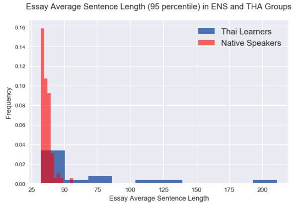
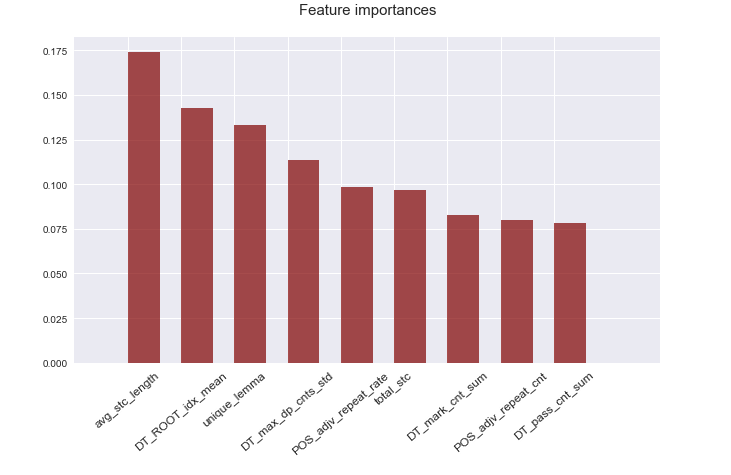
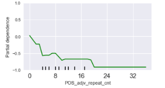
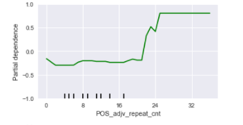

# Naked Word: Nationalities of World Language

_A native language identification project_

## Motivation
Regardless how rapid globalization develops, our world is still a very diverse place. Take the world language -- English for example, there are so many different flavors due to the fact that a large number of English speakers' native tongues are not English. These flavors make native language identification (NLI) possible. **NLI the task of determining an author's native language (L1) based only on their writings in a second language (L2).** NLI plays an important role not only in pure linguistic flied, but also in today's marketing, advertising, multinational corporate training, and even forensic investigations.

My project is inspired by the idea of applying machine learning techniques on NLI. The ultimate goal is to train a classifier to identify a writer's native tongue, given a piece of English writing from him or her.

## Data Description
For my project, I used the [International Corpus Network of Asian Learners of English (ICNALE)](http://language.sakura.ne.jp/icnale/download.html) provdided by Dr. Shin'ichiro Ishikawa, Kobe University, Japan. The corpus contains short English essays written by English learners from nine different native language backgrounds including native English.

A unique feature of the ICNALE is that the topics are controlled, which makes any type of contrastive interlanguage analysis more reliable and valid. All essays in the corpus are strictly written around the two topics below:
1) Is it important for college students to have a part time job?
2) Should smoking be completely banned at all the restaurants in the country?

## Feature Engineering
### Feature Extraction
| Feature Name | Description | Example |
| --- | --- | --- |
| unique_lemma | Count of unique lemmatized words in an essay | 122 |
| avg_stc_length | Count of average sentence length (how many words are there in a sentence) of an essay | 19 |
| total_stc | Count of sentences in an essay | 12 |
| DT_pos | Part-of-Speech tags for each word in an essay | ...PROPN VERB ADJ ADP PART VERB... |
| DT_archs | Dependent tree element labeling for each word in an essay | ...nsubj ROOT acomp prep pobj mark nsubj... |
| POS_adjv_repeat_rate | The portion of repeated adjectives and adverbs in an essay's overall vocabulary | 0.02 |
| POS_adjv_repeat_cnt | Total number of repeated adjectives and adverbs in an essay | 6 |
| DT_max_dp_cnts | List of max child-word count of each sentence for an essay | [4, 6, 6, 8, 8, 6, 8, 4, 5, 7, 6] |
| DT_max_dp_cnts_std | The standard deviation of a DT_max_dp_cnts value | 1.56 |
| DT_ROOT_idx | List of positions of the ROOT word in each sentence | [1, 9, 3, 16, 7, 1, 11, 2, 4] |
| DT_ROOT_idx_mean | The mean of a DT_ROOT_idx value | 12.87 |
| DT_pass_cnt | List of passive words in each sentence | [0, 0, 1, 0, 0, 0, 0, 2, 0] |
| DT_pass_cnt_sum | The sum of a DT_pass_cnt value | 3 |
| DT_mark_cnt | List of mark words in each sentence | [0, 0, 0, 0, 1, 0, 0, 0, 0] |
| DT_mark_cnt_sum | The sum of a DT_mark_cnt value | 1 |
| DT_pos_join | converting feature "DT_pos" into one string of pos tags of an essay | - |
| DT_archs_join | converting feature "DT_archs" into one string of pos tags of an essay | - |
| DT_insent_pos_ngram | same as feature "DT_pos_join", but only generate ngram terms within sentence boundary | - |
| DT_insent_arch_ngram | same as feature "DT_archs_join", but only generate ngram terms within sentence boundary | - |
| Doc2Vec vectors| Hidden layer vectors produced by a 3-layer neural network | - |
_Note: Doc2Vec vector feature is generated in an independent pipeline._

### Exploratory Data Analysis
There are some fascinating findings based on the generated features, below is one example:

The plot above demonstrates: Compare to native speakers, learners from Thailand tend to write more much longer sentences. This may be explained by the fact that in Thai(the language) script, full-stop doesn't exist. Therefore, the learners brought this habit to their L2 (English) writing.

## Feature Selection and Modeling
### Process and Insights
For feature selection, I used different combination of features and models to train the text classifier. I used the recall and cross-class accuracy scores to evaluate the classifier performance. During this process, there are some interesting observations:
1. Random Forest Feature Importance
I used several numeric features on random forest classifier, below is the feature importance chart of all used features

2. GradientBoosting Partial Dependence Plot
The same set of numeric features were used to train gradient boosting classifier. Below are two plots of _Japanese and Korean learner group_, the partial dependence plot shows that when the total count of adjective and adverb repetition is between 20 and 28, there is a higher probability the essay will be classified as Korean.

Japanese Learners

Korean Learners

3. High Frequency Syntactic Patterns
When using POS ngram and logistic regression to train to classifier, the model identified high frequency syntactic patterns from _Pakistani learner group_. Below are some examples are these highly repeated patterns:
`NOUN VERB DET NOUN`
”Students do the part-time-job …”
“men do the part-time-job …”
“parents offered the money …”

`ADP ADJ NOUN END-PUNCT`
“… on his family.”
“… to their studies.”
“… in our country.”
“… for his health.”

**Models Used**
- Logistic regression
- Naive Bayse
- Random Forest
- Gradient Boosting
- Adaptive Boosting
- Voting Classifier

### Best Feature and Model
Judged by the overall accuracy, Doc2vec document representation training a logistic regression model is the final strategy.
### Final Performance

## Future Work
1. Improve Accuracy of classification among Japanese and Korean learners' English writing
2. Run a test over out of corpus documents
3. Use pre-trained word2vec models to generate document vectors

## Additional Information
I have also put together several articles that illustrate the approaches I took for each of the steps mentioned above. They are a great
