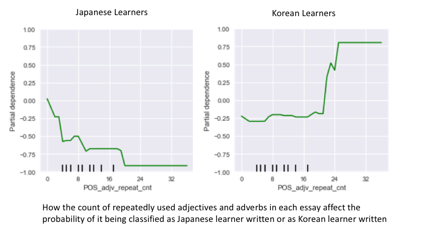
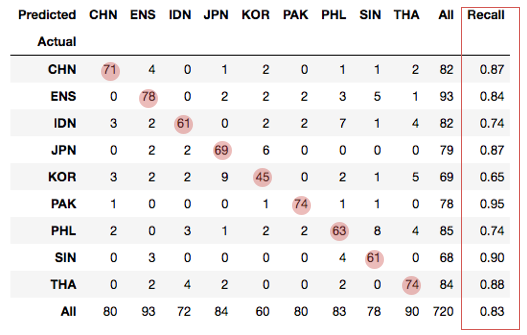

# Naked Word: Nationalities of World Language
## -- A Native Language Identification Project

## Motivation
Regardless how rapid globalization develops, our world is still a very diverse place. Take the world language -- English for example, there are so many different flavors due to the fact that a large number of English speakers' native tongues are not English. These flavors make native language identification (NLI) possible. **NLI is the task of determining an author's native language (L1) based only on their writings in a second language (L2).** NLI plays an important role not only in pure linguistic flied, but also in today's marketing, advertising, multinational corporate training, and even forensic investigations.

My project is inspired by the idea of applying machine learning techniques on NLI. The ultimate goal is to train a classifier to identify a writer's native tongue, given a piece of English writing from him or her.

## Data Description
For my project, I used the _International Corpus Network of Asian Learners of English (ICNALE)_ provdided by Dr. Shin'ichiro Ishikawa, Kobe University, Japan. The corpus contains short English essays written by English learners from nine different native language backgrounds including native English.

## Feature Engineering
### Feature Extraction
There are many possible ways to extract features out of text body. For the corpus I'm working on, there are five main categories of features:
- Ad hoc numeric statistics
- Part-of-Speech Tagging
- Depenence Tree Parsing
- Bag of Words
- Doc2Vec

For a complete list of generated features, refer to https://github.com/fzr72725/NLI/blob/master/README.md

### Exploratory Data Analysis
There are some fascinating findings based on the generated features, below is one example:

The plot above demonstrates: Compare to native speakers, learners from Thailand tend to write more much longer sentences. This may be explained by the fact that in Thai(the language) script, full-stop doesn't exist. Therefore, the learners brought this habit to their L2 (English) writing.

## Feature Selection and Modeling
### Process and Insights
For feature selection, I used different combination of features and models to train the text classifier. I used the recall and cross-class accuracy scores to evaluate the classifier performance. During this process, there are some interesting observations:

1. GradientBoosting Partial Dependence Plot

The same set of numeric features were used to train gradient boosting classifier. Below are two plots of _Japanese and Korean learner group_, the partial dependence plot shows that when the total count of adjective and adverb repetition is between 20 and 28, there is a higher probability the essay will be classified as Korean.

2. High Frequency Syntactic Patterns

When using POS ngram and logistic regression to train to classifier, the model identified high frequency syntactic patterns from _Pakistani learner group_. Below are some examples are these highly repeated patterns:

`ADP ADJ NOUN END-PUNCT`
- “… on his family.”
- “… to their studies.”
- “… in our country.”
- “… for his health.”

### Models Used
- Logistic regression
- Naive Bayse
- Random Forest
- Gradient Boosting
- Adaptive Boosting
- Voting Classifier

### Best Feature and Model
Judged by the overall accuracy, Doc2Vec document representation training a logistic regression model is the final strategy.
### Final Performance

## Future Work
1. Improve accuracy of classification among Japanese and Korean learners' English writing
2. Explore English writings from learners of other native languages, or higher proficiency (some Chinese authors wrote their books in English)
3. Use pre-trained doc2vec models to generate document vectors

## Additional Information
**My Pipeline of Text Classification Using Gensim's Doc2Vec and Logistic Regression**
https://fzr72725.github.io/2018/01/14/genism-guide.html
